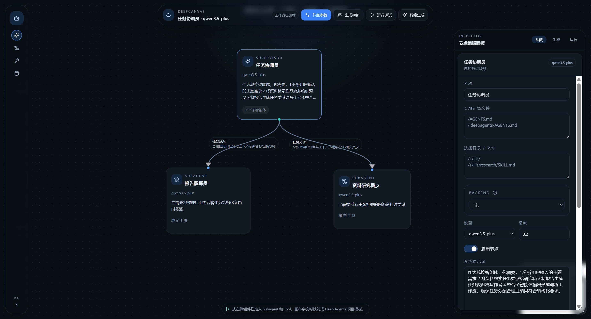

# DeepCanvas

Deep Agents 可视化工作流搭建器。

用于拖拽编排 `Supervisor / Subagent / Tool`，生成可二次开发的 Deep Agents 项目模板，并提供最小运行验证能力。

## 界面预览



## 功能

- React Flow 画布搭建工作流
- 拖拽绑定 `Supervisor -> Subagent`
- 拖拽绑定 `Subagent -> Tool`
- 编辑 prompt、model、temperature
- 生成 Deep Agents 项目模板
- 导出 zip 下载链接
- 最小运行、校验、事件日志

## 当前支持

- 通过画布搭建 `Supervisor / Subagent / Tool` 工作流
- 编辑总控、子智能体、工具、中间件、持久化配置
- 自动生成中文 prompt、节点配置和模板骨架
- 生成 Deep Agents 项目代码模板，并打包成 zip 下载
- 预留 `backend`、`persistence` 占位文件，便于后续二次开发
- 支持工具源码直接编辑，适合在模板生成前快速调整

## 技术栈

- 后端：FastAPI、SQLAlchemy async、PostgreSQL、Deep Agents
- 前端：Next.js、React Flow、Zustand、Tailwind

## 环境变量

根目录 `.env`：

```env
APP_TOOL_SCAN_PACKAGES=["app.tools"]
DEEP_AGENT_PG_HOST=127.0.0.1
DEEP_AGENT_PG_PORT=5432
DEEP_AGENT_PG_USER=postgresql
DEEP_AGENT_PG_PASSWORD=postgresql
DEEP_AGENT_PG_DATABASE=postgresql

DASHSCOPE_API_KEY=your-api-key
DASHSCOPE_BASE_URL=http://127.0.0.1:3000/v1
DASHSCOPE_MODEL=qwen3.5-plus
```

前端 `frontend/.env.local`：

```env
NEXT_PUBLIC_API_BASE_URL=http://127.0.0.1:8000/api
```

## 启动

后端：

```bash
.venv313/bin/alembic -c backend/alembic.ini upgrade head
.venv313/bin/uvicorn app.main:app --app-dir backend --reload
```

前端开发模式：

```bash
cd frontend
node node_modules/next/dist/bin/next dev
```

前端构建：

```bash
cd frontend
node node_modules/next/dist/bin/next build
```

## 访问地址

- 前端：`http://127.0.0.1:3000`
- 后端：`http://127.0.0.1:8000`
- API 文档：`http://127.0.0.1:8000/docs`

## 项目结构

- `backend/`：后端 API、持久化、Deep Agents 运行与模板生成
- `frontend/`：工作流画布与参数面板
- `downloads/`：生成后的模板压缩包

## 说明

- 生成模板会按当前 workflow 实际绑定关系裁剪代码。
- `app/backend.py` 和 `app/persistence.py` 会保留占位文件，方便后续二次开发。
- 工具支持直接编辑 `@tool` 修饰函数源码。
